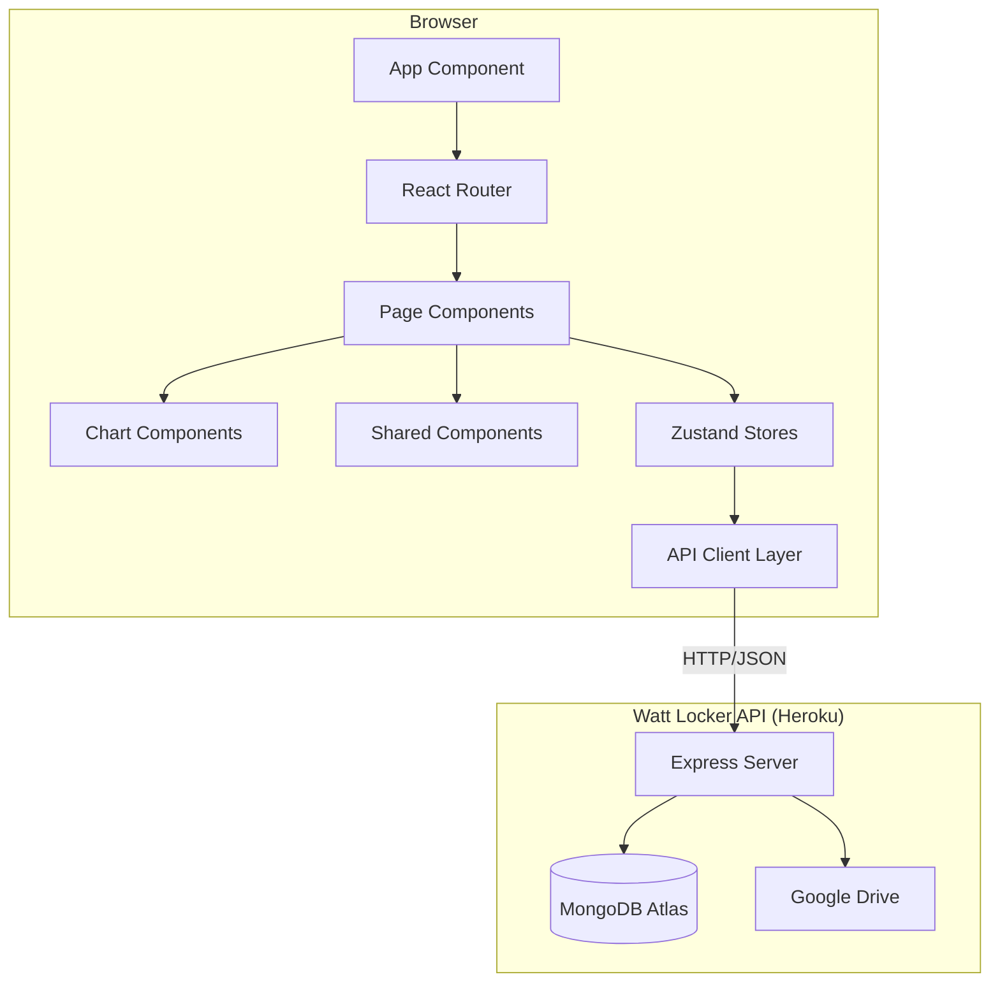

# Design Document: Watt Locker UI

## Overview

Watt Locker UI is a React single-page application that provides a frontend for the Watt Locker API backend. The application enables users to authenticate, view workout history in a sortable/paginated table, visualize training metrics via charts, import workout files (GPX/FIT/TCX), manage Google Drive settings, and view/edit workout details. The UI follows a dark navy-themed design with a consistent visual language across all pages.

The frontend communicates with the Express-based API at endpoints under `/api/` for authentication (`/api/auth/*`), workouts (`/api/workouts/*`), and settings (`/api/settings/*`). The API URL is configurable via the `VITE_API_URL` environment variable for deployment flexibility.

### Key Design Decisions

| Decision | Choice | Rationale |
|----------|--------|-----------|
| UI Framework | React 19 with TypeScript | Modern React with TypeScript for type safety |
| State Management | Zustand | Lightweight, minimal boilerplate, works well with React hooks |
| Styling | Tailwind CSS v4 | Utility-first approach, `@theme` directive for custom colors |
| Routing | React Router v7 | Industry standard for React SPAs, supports protected routes |
| HTTP Client | Axios | Interceptors for auth token injection and refresh handling |
| Build Tool | Vite 8 | Fast HMR, TypeScript support out of the box, modern defaults |
| Charts | Recharts | Composable React charting library, good Tailwind integration |
| Testing | Vitest + React Testing Library + fast-check | Matches Vite ecosystem |
| Deployment | Heroku (static site via `serve`) | Simple deployment, separate from API |

## Architecture



### Application Structure

```
watt-locker-ui/
├── public/
│   ├── Watt-Locker-Login-Background.png
│   ├── Watt-Locker-Logo.png
│   ├── Watt-Locker-Nav-Logo.png
│   ├── Watt-Locker-Wallpaper.png
│   └── favicon.png
├── src/
│   ├── api/
│   │   ├── client.ts          # Axios instance with interceptors + VITE_API_URL
│   │   ├── auth.ts            # Auth API calls (login, register, refresh)
│   │   ├── workouts.ts        # Workout API calls (list, get, upload, bulk, ingest, update)
│   │   └── settings.ts        # Settings API calls
│   ├── components/
│   │   ├── NavigationBar.tsx   # Logo, nav links, logout, "Watt Locker" label
│   │   ├── ProtectedRoute.tsx
│   │   ├── AuthenticatedLayout.tsx  # Nav + wallpaper wrapper
│   │   ├── WorkoutTable.tsx    # Sortable table with date/title/duration/distance/power/NP
│   │   ├── Pagination.tsx
│   │   ├── WeeklyMilesChart.tsx
│   │   ├── WeeklyDurationChart.tsx
│   │   ├── WeeklyNPChart.tsx
│   │   ├── WeeklyNPvsHRChart.tsx    # Dual-axis NP + HR
│   │   ├── RecentDecouplingChart.tsx # Last 10 workouts Pw:Hr
│   │   └── WeeklyTSSChart.tsx       # Bar chart
│   ├── pages/
│   │   ├── LoginPage.tsx
│   │   ├── RegisterPage.tsx
│   │   ├── DashboardPage.tsx   # Charts + table
│   │   ├── LockerPage.tsx      # Single/bulk/inbox upload
│   │   ├── AdminPage.tsx       # Drive path settings
│   │   └── WorkoutDetailPage.tsx  # Full workout details + inline title edit
│   ├── store/
│   │   ├── authStore.ts        # Auth state + localStorage persistence
│   │   ├── workoutStore.ts     # Workouts + sort/page + updateWorkout
│   │   └── settingsStore.ts
│   ├── types/
│   │   ├── workout.ts          # WorkoutRecord (full fields), WorkoutTableRow
│   │   ├── auth.ts
│   │   └── settings.ts
│   ├── utils/
│   │   ├── formatting.ts      # Date, duration, distance (miles), power formatters
│   │   ├── sorting.ts         # Client-side sort with dateRaw for date column
│   │   ├── pagination.ts
│   │   └── navigation.ts
│   ├── App.tsx                 # Route definitions
│   ├── main.tsx               # BrowserRouter wrapper
│   └── index.css              # Tailwind v4 @import + @theme
├── postcss.config.js          # @tailwindcss/postcss
├── vite.config.ts             # Vitest config + dev proxy
├── static.json                # Heroku static file config
├── Procfile                   # web: npx serve dist -s -l $PORT
├── .env.example
├── tsconfig.json
├── package.json
└── index.html
```

### Routing Architecture

| Route | Component | Protection | Layout |
|-------|-----------|-----------|--------|
| `/` | Redirect | — | — |
| `/login` | LoginPage | Public | Custom background |
| `/register` | RegisterPage | Public | Custom background |
| `/dashboard` | DashboardPage | ProtectedRoute | AuthenticatedLayout |
| `/locker` | LockerPage | ProtectedRoute | AuthenticatedLayout |
| `/admin` | AdminPage | ProtectedRoute | AuthenticatedLayout |
| `/workouts/:id` | WorkoutDetailPage | ProtectedRoute | AuthenticatedLayout |

Root `/` redirects to `/dashboard` if authenticated, `/login` otherwise.

## Data Models

### WorkoutRecord (Full)

```typescript
interface WorkoutRecord {
  id: string;
  userId: string;
  activityType: string;
  subActivityType?: string;
  startTime: string;
  endTime: string;
  durationSeconds: number;
  movingTimeSeconds?: number;
  distanceMeters: number;
  elevationGainMeters: number;
  elevationLossMeters?: number;
  calories?: number;
  avgTemperatureCelsius?: number;
  maxTemperatureCelsius?: number;
  avgPowerWatts?: number;
  maxPowerWatts?: number;
  normalizedPowerWatts?: number;
  totalWorkKj?: number;
  ftpWatts?: number;
  intensityFactor?: number;
  tss?: number;
  aerobicDecoupling?: number;
  avgHeartRateBpm?: number;
  maxHeartRateBpm?: number;
  avgCadenceRpm?: number;
  maxCadenceRpm?: number;
  totalPedalRevolutions?: number;
  avgSpeedMps?: number;
  maxSpeedMps?: number;
  aerobicTrainingEffect?: number;
  anaerobicTrainingEffect?: number;
  dataSource: string;
  title?: string;
  description?: string;
  tags?: string[];
  createdAt: string;
  updatedAt: string;
}
```

### WorkoutTableRow (Display)

```typescript
interface WorkoutTableRow {
  id: string;
  date: string;            // formatted display date
  dateRaw: string;         // ISO string for correct sorting
  name: string;            // title || activityType || 'Workout'
  duration: string;        // formatted (e.g., "1h 30m 5s")
  distance: string;        // formatted in miles (e.g., "23.46 mi")
  avgPower: string;        // formatted (e.g., "167 W")
  normalizedPower: string; // formatted from normalizedPowerWatts
}
```

### API Response Envelope

The API wraps all responses in a standard envelope:
```typescript
interface ApiEnvelope<T> {
  data: T;
  errors: null | Array<{ code: string; message: string; field?: string }>;
  pagination: PaginationMeta | null;
}
```

The UI's API modules unwrap this envelope, returning only the `data` payload.

## Dashboard Charts

### Row 1 (Weekly Trends - 8 weeks)

| Chart | Type | Data | Color |
|-------|------|------|-------|
| Weekly Miles | Line | Total distance per week (miles) | Electric Blue |
| Weekly Duration | Line | Total duration per week (hours) | Bright Cyan |
| Weekly Avg NP | Line | Average NP per week (watts) | Amber |

### Row 2 (Performance Metrics)

| Chart | Type | Data | Color |
|-------|------|------|-------|
| Avg NP vs Avg HR | Dual-axis Line | NP (left, amber) + HR (right, red) per week | Amber + Red |
| Pw:Hr Decoupling | Line | Last 10 workouts, reference lines at 0% (green) and 5% (yellow) | Purple |
| Weekly TSS | Bar | Total TSS per week (8 weeks) | Green |

All charts use Recharts with consistent dark theme styling (midnightBlue backgrounds, steelBlue grid lines, softFog axis text).

## Computed Metrics

### Normalized Power (NP)
- Computed during upload from time-series power data
- Algorithm: 30-second rolling average → 4th power → mean → 4th root
- FIT files: prefer session's `normalized_power` if available

### Training Stress Score (TSS)
- Formula: `(duration_s × NP²) / (FTP² × 3600) × 100`
- FIT files: prefer session's `training_stress_score` if available
- Default FTP: 200W (uses device FTP from FIT when available)

### Aerobic Decoupling (Pw:Hr)
- Compares first-half vs second-half power:HR ratio
- Formula: `((P1/HR1 - P2/HR2) / (P1/HR1)) × 100`
- Requires both power and HR data for at least 60 data points
- Always computed (not available in file formats)

## File Upload Architecture

### Upload Methods

1. **Single Upload** — Base64-encodes file in JSON body, sends to `POST /api/workouts/upload`
2. **Bulk Upload** — Base64-encodes multiple files, sends to `POST /api/workouts/upload/bulk`
3. **Inbox Ingestion** — Triggers `POST /api/workouts/ingest/inbox`, API reads from user's Google Drive inbox folder

### Upload Pipeline (API)
1. Validate file format (GPX/FIT/TCX)
2. Parse file → extract data points + summary
3. Check for duplicates (same user, startTime, durationSeconds)
4. Compute metrics (NP, TSS, decoupling) — prefer file values when available
5. Store raw file in Google Drive (per-user adapter from OAuth token)
6. Save workout record + time-series metrics to MongoDB

## Authentication & Token Management

- JWT access tokens (15min expiry) + refresh tokens (7 days)
- Tokens persisted to `localStorage` for session continuity
- Axios response interceptor: 401 → attempt refresh → retry original request
- On refresh failure: clear tokens, redirect to `/login`
- Logout: clears localStorage + store state, navigates to `/login`

## Deployment

### UI (Heroku - Static Site)
- Build: `tsc -b && vite build` (via `heroku-postbuild`)
- Serve: `npx serve dist -s -l $PORT`
- Config vars: `VITE_API_URL`, `NPM_CONFIG_PRODUCTION=false`

### API (Heroku - Node.js)
- Build: `tsc` (compiles to `dist/`)
- Start: `node dist/server.js`
- `trust proxy` enabled for rate limiting behind Heroku's router
- Config vars: `PORT`, `MONGO_URI`, `JWT_SECRET`, `JWT_REFRESH_SECRET`, `GOOGLE_*`, `CORS_ORIGIN`

## Error Handling

| Error Type | HTTP Status | UI Behavior |
|-----------|-------------|-------------|
| Invalid credentials | 401 | Display error message on login form |
| Token expired | 401 | Attempt silent refresh; if fails, redirect to login |
| Validation error | 400 | Display error message (e.g., duplicate workout) |
| Rate limited | 429 | Display "too many requests" message |
| Server error | 500 | Display generic error with retry option |
| Payload too large | 413 | API configured for 50MB JSON body limit |
